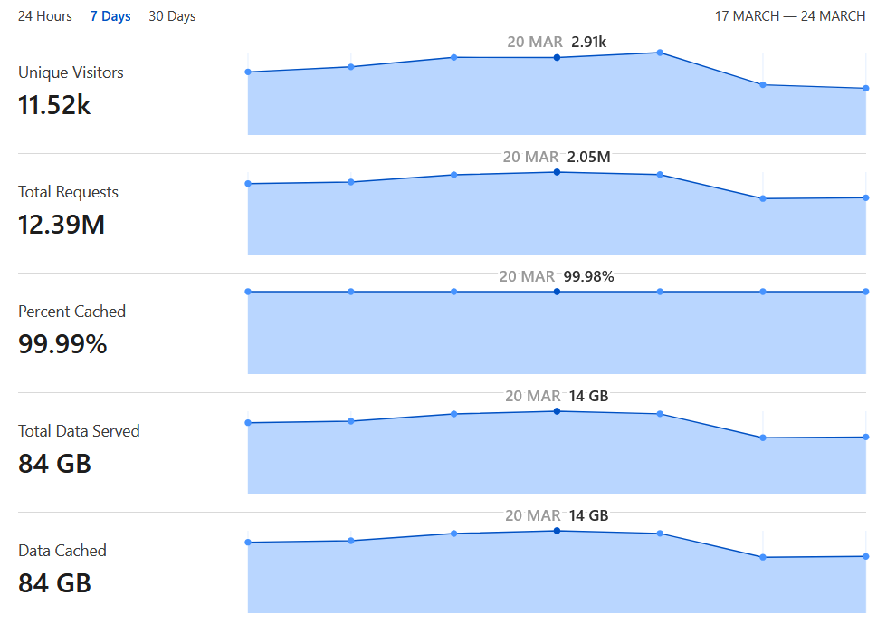

# Notify-FE v0.7

Available here [https://notify-fe.plen.io/](https://notify-fe.plen.io/)

Notify-FE is a web application designed to help users monitor and get notifications on the availability of NVIDIA GeForce **Founders Edition** GPUs across various regions from the official NVIDIA store. It provides frequent updates, region selection, and audio notifications to alert users as soon as their desired GPU becomes available.

## Acknowledgments

A quick thanks to [**Cloudflare**](https://github.com/cloudflare). They handled 2M+ daily requests with a 99.99% cache hit rate, protecting my R2 bucket from massive fees and saving the project from financial ruin — all while billing me exactly **$0** since implementation.

<div align="center">
  
</div>


## Monitored Cards

- NVIDIA GeForce RTX 5090 FE
- NVIDIA GeForce RTX 5080 FE
- NVIDIA GeForce RTX 5070 FE
- NVIDIA GeForce RTX 4090 FE
- NVIDIA GeForce RTX 4080 SUPER FE
- NVIDIA GeForce RTX 4070 SUPER FE

## Features

- **Automatic SKU Updates**: Automatically updates the SKU for each card.
- **Auto-open Shop Links**: Automatically opens the shop page in a new tab when a monitored GPU becomes available.
- **Cloudflare Queue Bypass**: For supported regions, use the Prime Cloudflare feature to improve chances of bypassing Cloudflare queue.
- **Client Side Requests**: Requests are sent directly from the client.
- **API Status**: Visual indicator showing if the API endpoint is reachable for each card.
- **Frequent Availability Updates**: Refreshes GPU availability every few seconds.
- **Region Selection**: Allows users to select their region for personalized availability.
- **Dark Mode**: Supports dark mode for a user-friendly experience at all hours.
- **Telegram Notifications**: Receive alerts about GPU availability via Telegram bot when a monitored GPU becomes available.


## Telegram Integration

To receive notifications about GPU availability through Telegram:

1. Set up your Telegram bot and get the required credentials ([setup guide](https://gist.github.com/nafiesl/4ad622f344cd1dc3bb1ecbe468ff9f8a))
2. In the application settings, enter your Telegram API URL in this format:
   ```
   https://api.telegram.org/bot<YOUR_BOT_TOKEN>/sendMessage?chat_id=<YOUR_CHAT_ID>
   ```
3. Click the "Test Telegram" button to verify your setup works

Once configured, you'll automatically receive Telegram messages when your monitored GPUs become available.

