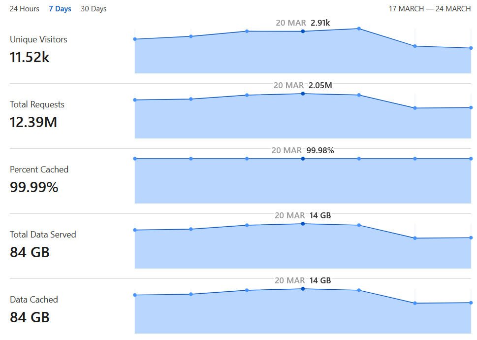

# Notify-FE

A lightweight, independent stock-alert frontend for NVIDIA GeForce **RTX 5090,
5080 and 5070 Founders Edition** cards.

This version receives availability from a shared monitor over WebSockets.
Visitors no longer poll NVIDIA or a SKU feed from their browsers.
Open [notify-fe.plen.io](https://notify-fe.plen.io/) to use the public watchlist.

## What it does

- Supports 13 regions: Germany, United Kingdom, Austria, Denmark, Spain, France,
  Italy, Netherlands, Norway, Poland, Finland, Sweden and United States.
- Shows all three cards, current reported availability and their last confirmed
  in-stock sighting. Missing history says “Not recorded yet.”
- Enables all three notification choices and sound on first visit; saves region,
  card choices, mute, volume and auto-open settings on the device.
- Provides a compact watchlist with a region selector, matching sound/auto-open
  buttons and a volume slider beside Test sound. Light/dark themes, visual alerts
  and the original slower 0.7× alert sound are included.
- Separates connection status from source health. An open connection does not
  mean the monitor is successfully checking stock.
- Displays global and regional **live listeners**. These count active alert
  subscriptions, not unique people; one person can have more than one.

Choose a region, leave the tab open and use **Test sound** before waiting.
Sound is enabled by default; a saved mute choice is respected.
Auto-open is beside the sound toggle; volume is beside **Test sound**.
Initial snapshots and reconnects are quiet; only fresh updates for selected cards
trigger alerts. Browser autoplay rules may require a user gesture, and sleeping
devices or suspended tabs can delay delivery. See the
[MDN autoplay guide](https://developer.mozilla.org/en-US/docs/Web/Media/Guides/Autoplay).

“Last seen in stock” is historical, not a guarantee of current availability.
Exact timestamps use the visitor's time zone. Auto-open is off until enabled;
when on, it attempts to open shop tabs for new alerts on selected cards. Allow
popups for this site if using it, or use the manual store links. Synthetic test
alerts never auto-open a real shop. There are no automatic purchase actions or
browser-side Telegram credentials. See [browser popup behavior](https://developer.mozilla.org/en-US/docs/Web/API/Window/open).

## Local development

Use Node.js **22.13+** and npm. The lockfile is authoritative. This application
uses Next.js 16 with the Pages Router and React 18.

```sh
npm ci
# Copy .env.example to .env.local and configure the public endpoint.
npm run dev
```

The frontend opens at `http://localhost:3000`. Configuration is validated in
`src/env.js`:

```dotenv
NEXT_PUBLIC_WEBSOCKET_URL=ws://127.0.0.1:8787/v1/ws
NEXT_PUBLIC_ALLOW_SYNTHETIC=false
NEXT_PUBLIC_ENABLE_DEMO=false
```

For a deployed service, use a credential-free `wss://<host>/v1/ws` URL and allow
the frontend's exact origin in that service. Never put a publisher secret or
proxy credentials in a `NEXT_PUBLIC_` variable. Public variables are embedded
at build time; restart development or rebuild after changing them.

For an isolated visual preview, set `NEXT_PUBLIC_ENABLE_DEMO=true` and visit
`/?demo=1&region=de-de`. It uses clearly labelled sample history and a “Simulate a
drop” button without opening a backend socket. Switch **Auto-open on**, then
click **Simulate a drop**: after a six-second countdown, the first selected card
triggers a demo alert and attempts to open a safe, same-site **Demo shop** tab.
It never opens a real shop or makes a purchase. If blocked, allow popups for
the preview site and retry, or click **Open demo shop** in the visual alert.
Changing region cancels a queued demo; sound and notification choices still
apply. The demo-shop route is unavailable when the demo flag is disabled.

To test a synthetic publisher,
also set `NEXT_PUBLIC_ALLOW_SYNTHETIC=true`. Keep both flags **false in
production**. Vercel production builds require both flags to be explicitly
`false` and a secure, credential-free WebSocket endpoint; the build fails if
these checks are not met. An unconfigured local endpoint displays an explicit
disconnected state.

## Checks

```sh
npm run check          # TypeScript
npm run lint           # ESLint with Next.js and type-aware TypeScript rules
npm test               # Preferences, protocol, freshness and alert deduplication
npm run build          # Release configuration checks and production compilation
npm run start          # Serve the production build
npm run test:browser   # Local browser acceptance test
```

Browser tests require the development server on `http://127.0.0.1:3000`, the
loopback WebSocket endpoint above, both preview flags enabled, and Chromium.
Set `CHROMIUM_EXECUTABLE` to an installed Chromium/Chrome executable.
`FRONTEND_TEST_URL` can select another loopback origin. The test mocks sockets,
blocks external browser requests, intercepts real-shop opening, tests actual
same-site demo popups (allowed and blocked) and Chromium audio restrictions,
exercises outages and saved settings, and saves
screenshots under ignored `.test-artifacts/` (or `SCREENSHOT_DIR`).

## Structure and transport

- `src/pages/`: Next.js routes and app metadata.
- `src/components/RealtimeMonitor.tsx`: watchlist, health panel and alerts.
- `src/hooks/`: WebSocket lifecycle and browser-aware alert audio.
- `src/lib/realtime/`: supported regions, validated messages, preferences and tests.
- `src/styles/monitor.module.css`: responsive light/dark presentation.
- `public/`: existing branding and alert sound.

One native WebSocket carries all three cards for the selected region. Alert
toggles filter locally, so they do not reconnect. Source heartbeats normally
arrive about every 30 seconds, separately from the monitor's 10-second stock-check
target. The interface shows source health and **Last heartbeat**; its age updates
locally and adds no polling requests. Text ping/pong checks transport liveness separately.
Cloudflare's automatic responses work while the Durable Object is hibernating:
[Cloudflare WebSocket auto-response documentation](https://developers.cloudflare.com/durable-objects/api/state/#setwebsocketautoresponse).

Older polling components remain for migration context but are not mounted by the
new homepage.

## Support

Got your card? [Say thanks on Ko-fi](https://ko-fi.com/timesaved) and add the card
and country to your message. Tips help keep the servers running. The support link
is optional; no donation or account is required to receive alerts.

## Acknowledgments

Thanks to [Cloudflare](https://github.com/cloudflare) for supporting the previous
cached-feed architecture: it handled 2M+ daily requests with a 99.99% cache hit
rate and a $0 bill. That is historical usage, not a cost guarantee for the new
WebSocket service.

<div align="center">
  
</div>

Notify-FE is a community project, not affiliated with NVIDIA.
